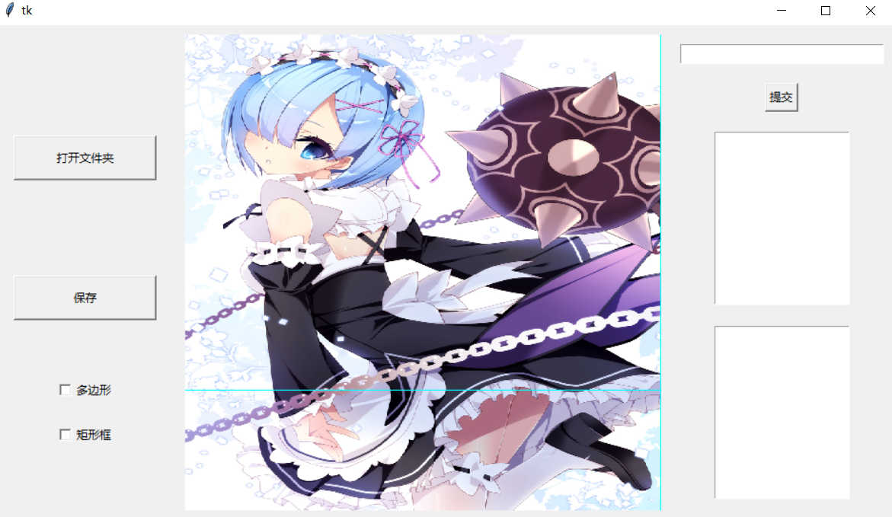
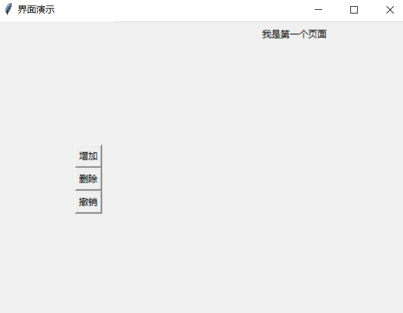
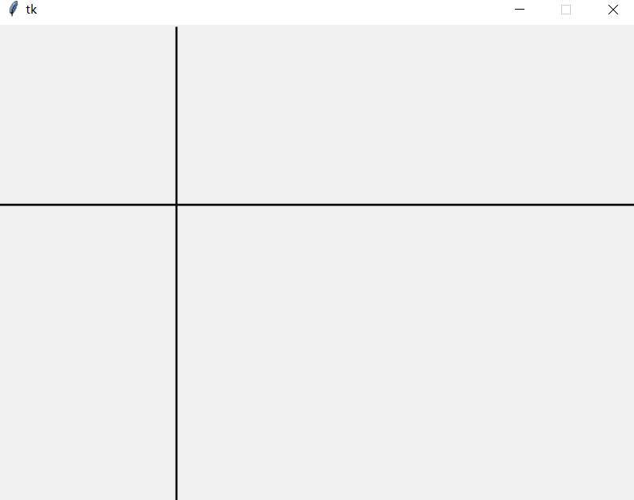
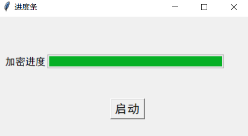
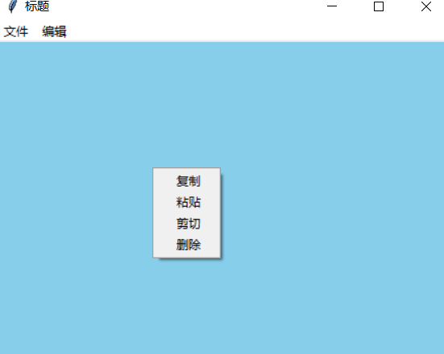
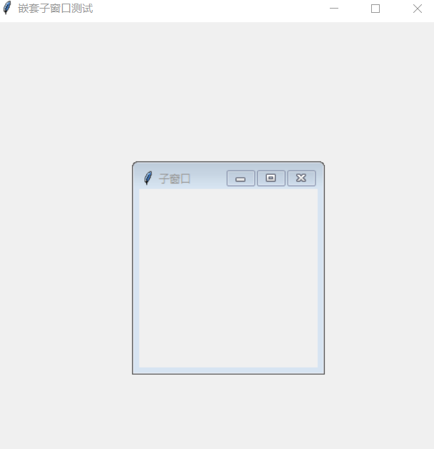
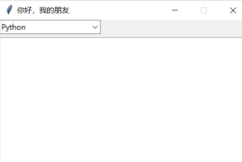
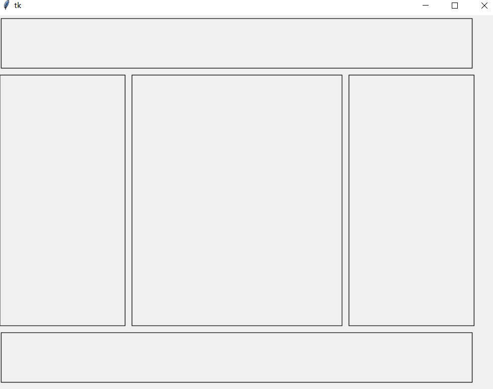

# 最近做的GUI做一个整合 (tkinter)

<br/>

📁 gui/<br/>
├─📁 image/<br/>
│ ├─📄 123.jpg<br/>
│ ├─📄 演示图片 (1).png<br/>
│ ├─📄 演示图片 (2).png<br/>
│ ├─📄 演示图片 (3).png<br/>
│ ├─📄 演示图片 (4).png<br/>
│ ├─📄 演示图片 (5).png<br/>
│ ├─📄 演示图片 (6).png<br/>
│ ├─📄 演示图片 (7).png<br/>
│ └─📄 演示图片 (8).png<br/>
├─📄 switch_page.py  <--多页面切换<br/>
├─📄 child_and_child.py  <--一个窗口嵌套一个窗口<br/>
├─📄 create_list.py  <--下拉框<br/>
├─📄 detect_key.py  <--检测键盘<br/>
├─📄 detect_mouse.py  <--检测鼠标<br/>
├─📄 detect_special_key.py  <--检测特殊按键<br/>
├─📄 draw_line.py  <--跟随鼠标画十字辅助线<br/>
├─📄 frame.py  <--多容器<br/>
├─📄 gpt_gui.py  <--整合的一个小demo<br/>
├─📄 menu.py  <--菜单栏<br/>
├─📄 process.py  <--进度条<br/>
├─📄 README.md<br/>
---------------------------------------
## 整合的一个小demo


文件``` gpt_gui.py ```
## 多页面切换


文件``` switch_page.py  ```
## 跟随鼠标画十字辅助线


文件``` draw_line.py ```
## 进度条


文件``` process.py ```
## 菜单栏


文件``` menu.py ```
## 一个窗口嵌套一个窗口


文件``` child_and_child.py ```
## 下拉框


文件``` create_list.py ```
## 多容器

文件``` frame.py ```
